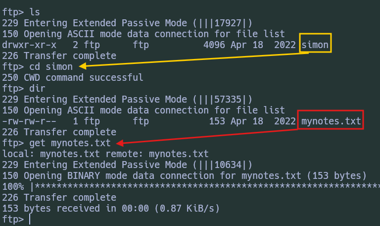

# Lab 1

- You are targeting the **`inlanefreight.htb`** domain. Assess the target server and obtain the contents of the flag.txt file. Submit it as the answer.
	- [x] 

> Luego de Agregar el dominio nuestro ETC/HOSTS junto con la dirección IP respectiva, procedemos a la enumeración.

- **Nmap - Lab 1**
  
	
	

> Vemos que tenemos el puerto 25 disponible, por lo que utilizamos la herramienta **`smtp-user-enum`** con la finalidad de encontrar usuarios en sistema.

- **smtp-user-enum**
  
	

> Ahora podemos intentar encontrar la contraseña del usuario. 

- **Hydra Attack SMTP**
  
	

> Podemos intentar dichas credenciales en la base de datos del puerto 3306.

- **Conexión a MySQL**
  
	

> Conseguimos ingresar. Ahora podemos enumerar la base de datos. Al buscar por la variable **`secure_file_priv`**, vemos que está vacía, lo cual es una mala configuración puesto que nos permite realizar operatorias como **`SELECT LOAD`** para leer archivos del sistema. 

- **Flag-Lab1**
  
	

### Flag Forma 2

> Como tenemos acceso a la lectura y escritura de archivos en MySQL, podemos abusar de esto igual y subir una **WebShell** al servicio HTTP que está corriendo en el puerto 80.

- **PHP info Expuesto**
  
	

> Como vemos tenemos la ruta de donde se encuentra la página principal, por lo que ahora podemos realizar un comando en **MySQL** donde creamos un archivo **WebShell** bajo dicha ruta.

- **Creación de WebShell con MySQL**
  
	

> Ahora si vamos a la ruta del archivo en nuestro navegador veremos lo siguiente al utilizar la variable **`c`** para ejecutar comandos: 

- **Whoami - WebShell**
  
	

> Ahora con esto si vamos a un **`revshells.com`** y realizamos un **Reverse Shell** en PowerShell #3 en **Base64** copiamos y pegamos para ejecutar en nuestra **Web Shell**, solo debemos estar en escucha con **netcat** por el puerto especificado y finalizar con la ejecución. El resultado será el siguiente:

- **ReverseShell - Obtenida**
  
	

- **Flag - Lab1**
  
	

# Lab 2

- Assess the target server and find the flag.txt file. Submit the contents of this file as your answer.
	- [x] 

> Iniciamos la enumeración del sistema con Nmap:

- **Nmap - Lab2**
  
	

> Vemos varios puertos y los que más destacan son tanto el **2121** y **30021**, dado que nos comunes, ambos corriendo servicios FTP, por lo que intentamos una sesión **Anonymous** en ambos.

- **FTP - Anonymous Access**
  
	

> Ahora listamos el contenido y logramos tener un archivo .txt **mynotes.txt**, que se encontraba en la carpeta de **Simon**.

- **FTP - MyNotes.txt - Simon**
  
	

> El archivo contiene una serie de Strings, las cuales parecen datos personales de simon, podemos intentar utilizar dicho archivo para intentar un ataque de fuerza bruta contra el protocolo ssh.

- **Conexión SSH como Simon**
  
	

> Una de las cadenas en efecto era la contraseña del usuario por lo que tenemos acceso y obtenemos la flag.

# Lab - Hard

> The third server is another internal server used to manage files and working material, such as forms. In addition, a database is used on the server, the purpose of which we do not know.

- What file can you retrieve that belongs to the user "simon"? (Format: filename.txt)
- [x] 

- Enumerate the target and find a password for the user Fiona. What is her password? 
- [x] 

- Once logged in, what other user can we compromise to gain admin privileges? 
- [x] 

- Submit the contents of the flag.txt file on the Administrator Desktop.
- [x] 

> Iniciamos la enumeración con Nmap

- **Nmap - Lab3**
	

> Vemos el puerto 445 abierto por lo que intentamos enumerar los recursos compartidos en SMB con una **Null Session**.

> Una vez ya hemos enumerado los recursos, descubrimos el directorio **`IT`** dicho directorio contiene otros sub-directorios de cada usuario del sistema. De cada uno de ellos logramos obtener un archivo.txt importante.

- **Archivos Importantes - SMB**
	

> Ahora con todos estos datos podemos intentar ingresar a un servicio, por lo ejemplo con el archivo de **John**, **secrets.txt**, vemos que una de las contraseñas es ***TestingDB123*** por lo que podemos intentar este pequeño archivo como diccionario e intentar conectarnos por fuerza bruta al servicio como el usuario **John**.

> Esto no tiene éxito por lo que intentamos conectarnos con las credenciales de Fiona y logramos conectarnos vía **RDP** a la máquina Víctima. Una vez dentro podemos utilizar **sqlcmd** para interactuar con la base de datos, pero por mayor comodidad decidimos hacerlo con la herramienta **mssqlclient.py**.

- **Conexión a MSSQL como Fiona**
	

> Una vez dentro identificamos nuestro Rol:

- **ROL MSSQL Fiona**
	

> Como vemos no tenemos el rol **sysadmin**, por lo que procedemos a listar los usuarios que podríamos impresionar y luego verificar si dichos usuarios cuentan con el rol **sysamin**.

> No tenemos éxito enumerando los usuarios, pero sabemos que John es el usuario que tenía una contraseña relacionada con DB, por lo que intentamos **Personificar a Dicho Usuario**

> Logramos cambiar al usuario con éxito.

- **Flag Lab3**
	

> En el cuadro **Rojo** vemos como logramos migrar al usuario Jhon. En el Cuadro **Azul** buscamos la existencia de base de datos remotas o Linked Databases, además de conseguirlas ejecutamos el comando:

- **EXECUTE('select @@servername, @@version, system_user, is_srvrolemember(''sysadmin'')') AT [local.test.linked.srv]**

> Con la finalidad de ver los permisos que tenemos en la Linked Database **`local.test.linked.srv`**. Con la cual si contamos con el Rol **sysadmin**.

> Para finalizar en el Cuadro **Verde** buscamos leer el contenido de la Flag Final ejecutando el siguiente comando:

- **execute ('select * from OPENROWSET(BULK ''C:/Users/Administrator/desktop/flag.txt'', SINGLE_CLOB) AS Contents') AT [local.test.linked.srv]**

> Donde, ejecutamos (`execute`) el comando entre **`()`** que indica que queremos leer el archivo especificado, ¿en donde? en **`AT`** el **Linked Server**. Lo que nos termina devolviendo la flag solicitada.
